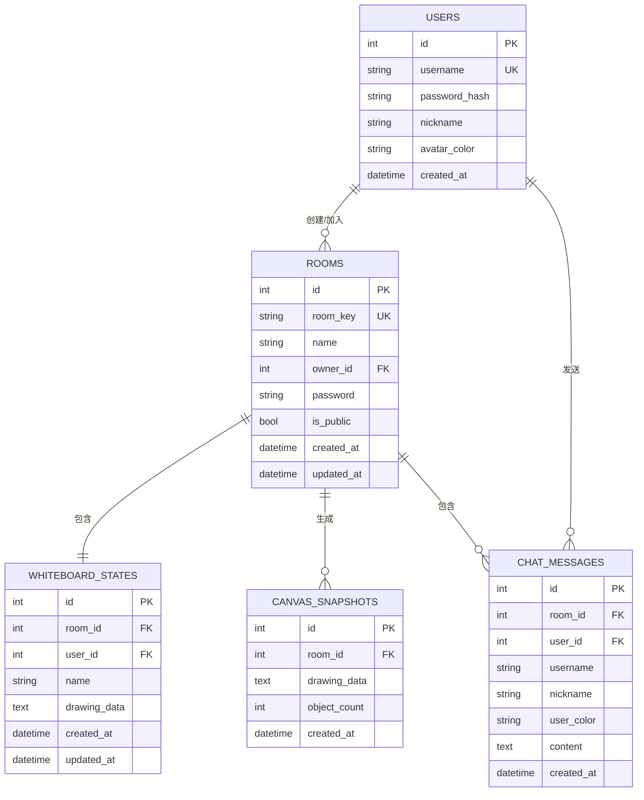

# 白板协作系统 — 项目分析与答辩讲解

---

## 第一部分：项目概述

### 1.1 项目背景

随着远程办公和在线教育的快速发展，团队成员异地协作时缺少一块能实时共享、共同编辑的数字画板，导致以下场景的沟通效率低下：

- **在线课堂互动**：教师板书 + 学生参与，缺乏实时可视化工具
- **远程UI评审**：产品/设计/开发三方协同标注，沟通成本高
- **异地协同设计**：设计师和开发实时沟通，需要直观的绘图工具

现有白板工具要么需要下载客户端，要么实时同步体验卡顿，难以满足轻量级协作需求。

### 1.2 项目目标

构建一款**无需安装、打开即用**的Web协作白板，实现：

| 指标 | 目标值 |
|:---|:---|
| WebSocket 消息延迟 | < 150ms（同区域网络） |
| 画板渲染帧率 | ≥ 30fps |
| 全量状态同步时间 | ≤ 2秒 |
| 同时在线人数 | ≥ 50人/房间 |

### 1.3 核心技术栈

```
┌─────────────────────────────────────────────┐
│          前端展示层                           │
│  Vite + 原生Canvas 2D API + JavaScript       │
│  功能：交互捕获、乐观渲染、WebSocket通信       │
├─────────────────────────────────────────────┤
│          后端服务层                           │
│  FastAPI + Uvicorn + WebSocket + APScheduler  │
│  功能：连接管理、消息路由、房间管理、定时任务    │
├─────────────────────────────────────────────┤
│          数据持久层                           │
│  PostgreSQL 12+（主存）+ Redis 5.x（缓存）    │
│  策略：双写策略 + 定时快照 + 降级机制          │
└─────────────────────────────────────────────┘
```

---

## 第二部分：核心功能模块分析

### 2.1 八大功能模块

| 模块 | 核心功能 | 负责人 |
|:---|:---|:---:|
| ① 房间管理模块 | 创建/加入房间、密码验证、用户列表、房主权限 | 熊乙鸣+陈超滨 |
| ② 绘图工具模块 | 12种绘图工具（画笔/矩形/圆形/文字/橡皮擦等） | 熊乙鸣 |
| ③ 实时同步模块 | WebSocket 操作序列化、广播、冲突处理 | 熊乙鸣 |
| ④ 图形编辑模块 | 选中/移动/缩放/改色/删除、撤销/重做 | 张兆嘉 |
| ⑤ 用户认证模块 | JWT登录注册、游客模式、Token鉴权 | 陈超滨 |
| ⑥ 聊天系统模块 | 实时文本聊天、消息持久化、XSS过滤 | 陈超滨 |
| ⑦ 存档系统模块 | 保存/加载/删除画板、缩略图预览 | 陈超滨 |
| ⑧ 数据持久化模块 | PostgreSQL+Redis双写、定时快照、恢复机制 | 陈超滨 |

### 2.2 功能模块架构图

```
                         ┌─────────────┐
                         │  白板协作系统  │
                         └──────┬──────┘
                ┌───────────────┼───────────────┐
                │               │               │
        ┌───────┴───────┐ ┌────┴────┐ ┌───────┴───────┐
        │  房间管理模块   │ │ 绘图模块 │ │  实时同步模块   │
        │  ·创建/加入    │ │ ·12种工具│ │  ·WebSocket   │
        │  ·密码验证     │ │ ·颜色粗细│ │  ·序列化广播   │
        │  ·房主权限     │ │ ·笔刷模式│ │  ·冲突处理     │
        └───────────────┘ └─────────┘ └───────────────┘
        ┌───────────────┐ ┌─────────┐ ┌───────────────┐
        │  图形编辑模块   │ │ 认证模块 │ │  聊天系统模块   │
        │  ·选中/移动    │ │ ·JWT    │ │  ·实时聊天     │
        │  ·缩放/改色    │ │ ·游客   │ │  ·消息持久化   │
        │  ·撤销/重做    │ │ ·Token  │ │  ·XSS过滤      │
        └───────────────┘ └─────────┘ └───────────────┘
        ┌───────────────┐ ┌─────────┐
        │  存档系统模块   │ │ 持久化模块│
        │  ·保存/加载    │ │ ·PG+Redis│
        │  ·缩略图预览   │ │ ·双写    │
        │  ·删除存档     │ │ ·快照恢复│
        └───────────────┘ └─────────┘
```

---

## 第三部分：数据库设计分析

### 3.1 五张核心表



### 3.2 实体关系说明

| 关系 | 类型 | 说明 |
|:---|:---:|:---|
| 用户 → 房间 | 多对多 | 一个用户可创建/加入多个房间，一个房间可容纳多个用户 |
| 用户 → 聊天消息 | 一对多 | 一个用户可在单个房间内发送多条消息 |
| 房间 → 画板状态 | 一对一 | 每个房间有且仅有一个当前活跃画板状态 |
| 房间 → 画板快照 | 一对多 | 系统定时为每个房间生成多条快照记录 |
| 房间 → 聊天消息 | 一对多 | 一个房间内可产生多条聊天消息 |

### 3.3 双写策略说明

```
用户操作 → 前端Canvas渲染（乐观）
         → WebSocket发送操作数据
              ↓
        后端接收 → 写入Redis（高速缓存）
                → 写入PostgreSQL（可靠持久化）
                → 广播给房间其他用户
                
Redis不可用时 → 自动降级为内存缓存 + PostgreSQL直写
```

---

## 第四部分：答辩常见问题与回答

### 4.1 项目整体类

#### Q1: 这个项目的核心功能是什么？
> 核心功能是一个实时协作白板。用户打开浏览器就能创建或加入房间，使用画笔、图形等工具在画板上绘图，所有操作会通过WebSocket实时同步给房间内其他用户。同时支持实时聊天、画板存档、用户认证等功能。

#### Q2: 和市面上已有的白板工具（如Miro、BoardMix）相比，你们的优势在哪？
> 第一是轻量，无需安装任何客户端，浏览器打开即用。第二是部署成本极低，所有技术栈都是开源免费的。第三是操作简便，专注核心绘图和协作功能，学习成本低。对于小型团队日常协作场景来说，够用且不臃肿。

#### Q3: 你们的分工是怎样的？
> 我们团队三人分工明确：熊乙鸣负责第一阶段MVP核心功能（WebSocket通信、画笔工具、基本图形等）；张兆嘉负责第二阶段体验完善（图形编辑、性能优化、移动端适配等）；我（陈超滨）负责第三阶段协作增强与存储（数据库集成、用户认证、聊天系统、存档系统等）。

---

### 4.2 技术实现类

#### Q4: WebSocket是怎么实现实时同步的？
> 用户在前端画一条线，操作数据被序列化成JSON对象，通过WebSocket发送到后端。后端的ConnectionManager收到消息后，广播给同一房间内所有其他用户。其他用户前端收到消息后反序列化并渲染到Canvas上。整个过程端到端延迟小于150ms。

#### Q5: PostgreSQL和Redis双写怎么设计的？
> 每次绘图操作同时写入Redis和PostgreSQL。Redis写入快，保证用户实时读取速度。PostgreSQL作为可靠存储负责持久化。如果Redis宕机，系统自动降级为内存缓存+PostgreSQL模式。定时快照任务还会从PostgreSQL同步到Redis，确保双写数据最终一致。

#### Q6: JWT认证怎么工作的？
> 用户登录后，后端用python-jose库签发一个JWT Token返回给前端，Token中携带用户ID和有效期。前端将Token存储在localStorage中，后续每次请求通过Authorization头部携带。后端用中间件验证Token的签名和有效期，验证通过才允许访问。密码使用bcrypt哈希加密存储，即使数据库泄露也无法还原原始密码。

#### Q7: 定时快照和重启恢复是怎么实现的？
> 使用APScheduler库设置每5分钟执行一次的定时任务，遍历所有在线房间，将当前画板数据序列化成JSON，写入canvas_snapshots表。服务启动时，会遍历所有房间记录，从最新快照中反序列化绘图数据加载到内存中，确保重启后画板数据不丢失。

#### Q8: 断线重连怎么处理？
> 前端WebSocket连接断开后会自动尝试重连（指数退避策略）。重连成功后，后端会把当前房间的全量画板状态一次性发送给客户端，客户端的Canvas重新渲染所有内容，保证画板和断开前完全一致。

---

### 4.3 问题与改进类

#### Q9: 项目存在什么技术难点？你是如何解决的？
> 最大的难点是双写策略中的数据一致性问题。Redis和PostgreSQL同时写入，如果其中一方写入失败会导致数据不一致。我的解决方案是采用"先写Redis、再写PG"的顺序，配合定时任务做最终一致性校验。同时如果Redis不可用，系统自动降级为内存+PG模式，不影响核心功能。

#### Q10: 还有什么可以改进的地方？
> 第一，可以引入OT算法或CRDT来解决多用户同时编辑同一对象的冲突问题。第二，可以增加图形分层能力，让绘图对象有上下层级关系。第三，可以接入AI辅助功能，比如文字生成图形。第四，当前是本地部署，可以上云实现公网访问。

---

### 4.4 测试验证类

#### Q11: 项目做了哪些测试？结果如何？
> 功能测试覆盖了JWT登录注册、PostgreSQL数据持久化、Redis缓存读写、存档保存加载、聊天消息发送删除六个核心用例，全部通过。性能方面，WebSocket消息延迟小于150ms，画板渲染帧率超过30fps，支持50人同时在线协作。

#### Q12: 你们的测试用例是怎么设计的？
> 采用黑盒测试方法，基于需求规格设计用例。比如登录测试：输入正确账号密码→预期返回JWT Token；登录失败→预期返回错误提示。数据持久化测试：绘制图形后保存存档→预期数据库中写入记录。每个用例都明确包括输入数据、操作步骤、预期输出三个要素。

---

## 第五部分：答辩PPT建议结构

| 页码 | 内容 | 要点 |
|:---:|:---|:---|
| 1 | **封面** | 项目名称、团队成员、班级、日期 |
| 2 | **项目背景** | 远程办公痛点、国内外现状、项目目标 |
| 3 | **技术栈总览** | 前后端技术选型及理由 |
| 4 | **系统架构图** | 三层B/S架构 + 数据流向 |
| 5 | **功能模块** | 八大模块图示，标注各自负责部分 |
| 6 | **数据库设计** | 五张表 + E-R图 + 双写策略 |
| 7 | **个人贡献（重点）** | 数据库集成、双写、快照、认证、聊天、存档（截图+代码片段） |
| 8 | **测试结果** | 测试用例表 + 性能数据 |
| 9 | **项目演示** | 录屏或截图展示实际运行效果 |
| 10 | **总结与展望** | 总结 + 改进方向 |

---

## 第六部分：答辩技巧速记

| 场景 | 应对策略 |
|:---|:---|
| 被问"你负责什么" | 先总述再展开：我负责V1.5协作增强模块，具体包括xxx…… |
| 被问技术细节 | 先说结论再说实现：我们用双写策略——先写Redis再写PG——原因是…… |
| 被问"和XX有什么区别" | 不踩别人，突出自己的优势：我们更轻量、部署成本更低…… |
| 被问到不会的问题 | 诚实但积极：这个问题我们团队有讨论过，目前采用的是XX方案，但更好的方式可能是…… |
| 展示代码时 | 先说明功能，再展示关键代码片段，不要贴大段代码 |
| 导师质疑时 | 先接受建议：老师说得对，这也是我们考虑改进的方向之一…… |
